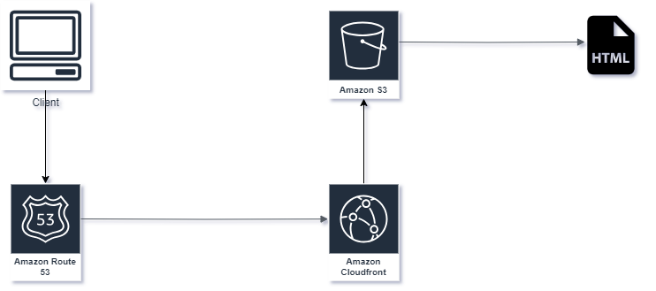

### Static Website For Python Homework

The reason for this static website was to send simple steps on how to install and set up Python for my students.

##### The Set Up

###### 1. Amazon CloudFront

>* Is a content delivery network made for high performance, security, and makes everything easier for a developer.

>* CloudFront enables us to redirect an http to  https connection.

###### 2. Amazon Route 53

>* Is a domain name registry.

>* The domain name was issued using Route 53 and a public SSL/TLS was provided using Amazon Certificate Manager. 

###### 3. Amazon S3

>* Is used to keep files like images, static files(Javascript, Css, videos etc)

>* It also allows us to host static websites like [Click to see the website](https://s3.projectstatus.click/) 